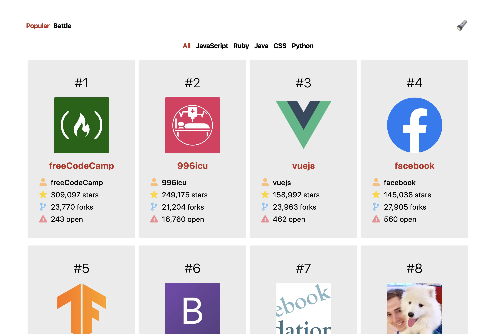
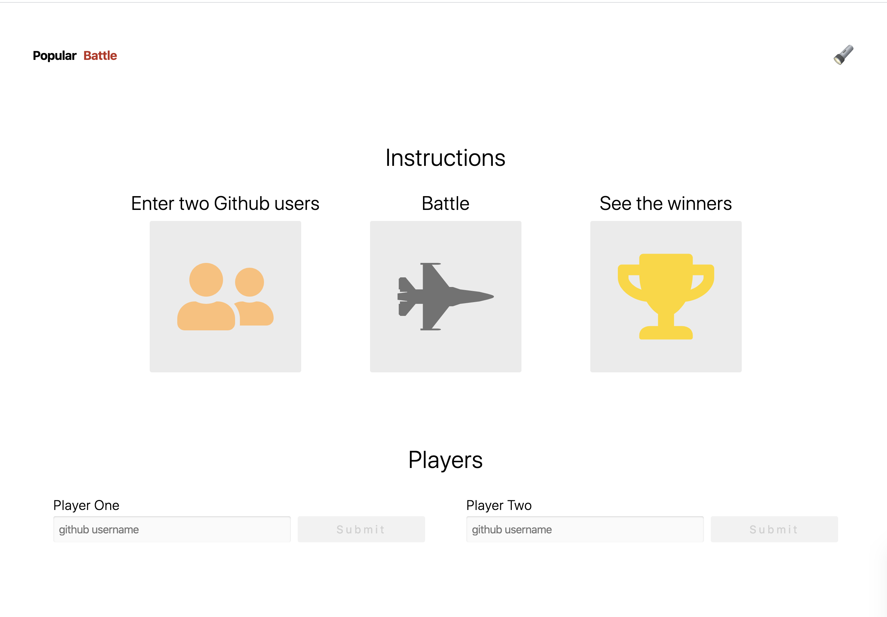

# Github Battle

Utilizing the Github API, users can search the most popular repos in all coding languages or narrow it down to one specific lanuage. Users can also switch to the Battle view, which allows them to battle two different github users and determine a winner based on number of repos.

Users can also switch between a light interface and a dark interface using the flashlight/lightbulb icon on the top right.

## Built With

- [REACT](https://reactjs.org/)

- [HTML5](https://developer.mozilla.org/en-US/docs/Web/Guide/HTML/HTML5)

- [CSS3](https://developer.mozilla.org/en-US/docs/Learn/CSS/Introduction_to_CSS)

## Personal learnings

- It was my first time working with REACT, so it was great to discover that it just built on and reinforced my ES6 knowledge
- Understanding how elements and components work together
- Using an API with REACT
- Learning to work with REACT Router and creating a 404 using Switch
- Learning to refactor classes to class fields
- Understanding the difference between development and production mode and setting up webpack.config and package.json accordingly
- First time setting up and deploying a site using Netlify

## Authors

- [Karla Gonzalez](https://github.com/karlapaulina)
